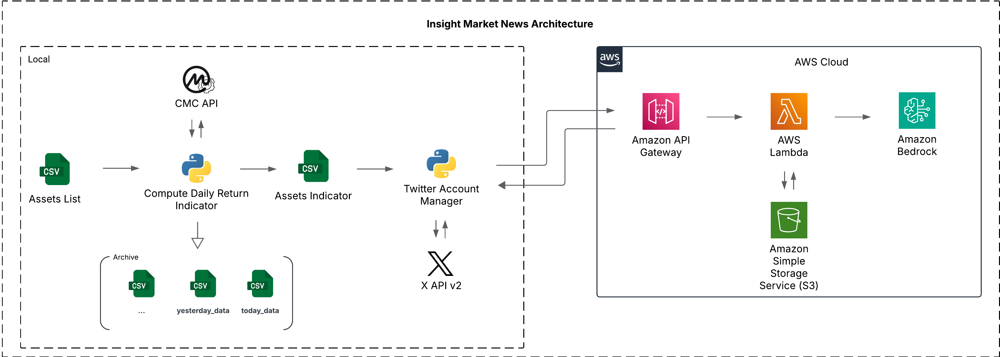

# Insight Market News


Votre source quotidienne d’analyses et d’actualités sur l’économie, la finance, la politique et la santé. Suivez nos insights pour prendre des décisions plus éclairées.

## Objectif du Projet

Le projet a pour but de partager des actualités, des indicateurs et des annonces économiques en temps réel. Cette version **v1.0.0** se concentre sur l'extraction des tendances des cryptomonnaies et d'autres actifs financiers à partir de l'API CoinMarketCap. Les données sont ensuite synthétisées par **AWS Bedrock** afin de générer un post qui sera automatiquement publié sur le compte **Insight Market News (compte X)**. L'objectif est d'informer les utilisateurs des tendances du marché en toute transparence.

## Architecture



## Fonctionnalités principales (Incrémentation en cours)

### 🔍 **Analyse en temps réel**
- Agrégation des dernières nouvelles des marchés boursiers à partir de sources fiables.
- Suivi des indices mondiaux (Dow Jones, Nasdaq, CAC 40, etc.).
- Notifications sur les mouvements importants des marchés (alertes de volatilité).

### 📊 **Graphiques et Tendances**
- Visualisation des tendances à l’aide de graphiques clairs et dynamiques.
- Analyse technique simplifiée (moyennes mobiles, RSI, etc.).
- Intégration de données historiques pour suivre l’évolution des cours.

### 📈 **Informations clés**
- Aperçu des performances journalières, hebdomadaires, et mensuelles des actions et indices.
- Indicateurs macroéconomiques (taux d’intérêt, inflation, etc.).
- Analyse des secteurs économiques et des entreprises phares.


## Fonctionnalités (V 1.0.0 Implémenté)

- Extraction des données de tendances de cryptomonnaies via l'API CoinMarketCap. [Lien du projet GitHub](https://github.com/mohamedberte/crypo_analysis_realtime/)
- Utilisation d'**AWS Bedrock** pour l'analyse et la synthèse des données.
- Déploiement de fonctions **AWS Lambda** pour le traitement des données.
- Utilisation d'**API Gateway** pour gérer les requêtes et les réponses.
- Publication automatique des posts sur le compte **Insight Market News**.

## Technologies Utilisées

- **API CoinMarketCap** : Extraction des données de tendances des cryptomonnaies.
- **AWS Bedrock** : Analyse et synthèse des données.
- **AWS Lambda** : Traitement des données.
- **API Gateway** : Gestion des requêtes et des réponses.
- **Compte X (anciennement Twitter)** : Publication des posts.

## Installation

1. Clonez le dépôt :
    ```bash
    git clone https://github.com/username/insightmarketnews.git
    ```
2. Installez les dépendances :
    ```bash
    cd insightmarketnews
    ```

## Utilisation

Configurez les clés API pour **Twitter (X v2)** dans le fichier `.env`.

## Contribuer

Ce projet dévéloppé **traiss02** et **mohamedberte** . Les contributions sont les bienvenues ! Veuillez soumettre une **pull request** ou ouvrir une **issue** pour discuter des améliorations.

## Licence

Ce projet est sous licence **Free**. Voir le fichier [LICENSE](LICENSE) pour plus de détails.

## Structure du Projet

```
__pycache__/
.env
.gitignore
api.py
knowledge/
    post/
        crypto_post_2025-02-02.txt
main.py
readMe.md
```

## Description des Fichiers

- `main.py` : Script principal pour l'extraction, l'analyse et la publication des données de performance des cryptomonnaies.
- `api.py` : Contient les classes pour interagir avec l'API X (anciennement Twitter) et AWS API Gateway.
- `knowledge/post/` : Dossier contenant les fichiers texte des posts quotidiens sur les performances des cryptomonnaies.
- `.env` : Fichier de configuration des clés API.
- `.gitignore` : Liste des fichiers et dossiers à ignorer dans Git.
- `readMe.md` : Documentation du projet.

## Exécution du Script Principal

Le script principal `main.py` suit les étapes suivantes :
1. Charge les variables d'environnement depuis `.env`.
2. Récupère les données de performance des cryptomonnaies pour aujourd'hui et hier.
3. Trie les données pour obtenir les meilleures performances.
4. Génère le texte du post à partir des données triées.
5. Enregistre le texte du post dans un fichier.
6. Publie le post sur **X** via l'API.

## Exemple de Post Généré

```
🚀 Top 5 Crypto Performances Today (2025-02-04) 🚀

📊 Comparatif avec hier :
🔥 Bitcoin (BTC) maintient sa place en tête avec +5.2% aujourd’hui !
🎉 Solana (SOL) fait une entrée fracassante dans le top avec +8.4% !
⚠️ Ethereum (ETH) ralentit mais reste solide avec +2.1%.

🔹 Classement du jour :
1️⃣ Bitcoin (BTC) – +5.2% | $44,320 | Volume 24h : $25B
2️⃣ Solana (SOL) – +8.4% | $112.4 | Volume 24h : $8B
3️⃣ Ethereum (ETH) – +2.1% | $2,540 | Volume 24h : $15B
4️⃣ XRP (XRP) – +3.8% | $0.67 | Volume 24h : $3B
5️⃣ Cardano (ADA) – +4.5% | $0.52 | Volume 24h : $2B

📌 Le marché évolue vite, restez informés ! 📌
⚠️ Ceci n'est pas un conseil financier. Faites vos propres recherches avant d’investir.

#Crypto #TopPerformers #CryptoMarket #Bitcoin #Ethereum #Solana
```
